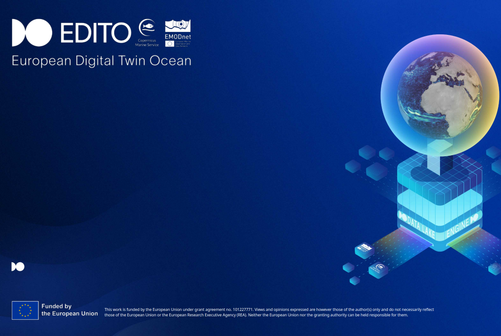

<!-- _class: title-slide no-pagination -->

<div class="title-wrap">
  <h1 class="title">NCZarr Viewer</h1>
  <div class="subtitle">Exploring and Subsetting Zarr &amp; NetCDF Data</div>
  <div class="meta">2 Sept 2025 </div>
  <div class="meta"> Samuel Fooks — VLIZ </div>
</div>

---

# NCZarr Viewer

- 📊 **Load and explore** Analysis Ready Cloud Optimized(ARCO) NetCDF and Zarr datasets
- 🔍 **Browse variables** and dimensions through a simple interface
- ✂️ **Subset data** by time, space, and other dimensions visually
- 📈 **Visualize results** with interactive plots
- 🐳 **Containerized** for easy deployment and sharing
- [In EDITO Datalab!](https://datalab.dive.edito.eu/launcher/service-playground/netcdf-zarr-viewer?name=netcdf-zarr-viewer&version=1.0.3)

---

# 🛠️ Technology Stack

- **Frontend**: Dash + Bootstrap Components
- **Data Processing**: Xarray + NumPy
- **File Formats**: NetCDF4, Zarr
- **Visualization**: Plotly, Matplotlib, Cartopy

---

# 🚀 Quick Start

[On EDITO](https://datalab.dive.edito.eu/launcher/service-playground/netcdf-zarr-viewer?name=netcdf-zarr-viewer&version=1.0.3)

**DOCKER** 
```bash
docker run -p 8050:8050 samfooks/nczarr-viewer:latest
```
**LOCAL DEV**
```bash
git clone https://github.com/EDITO-Infra/nczarr-viewer
cd nczarr-viewer
pip install -r requirements.txt
python run.py
```
**Access at**: http://localhost:8050
<small>**💡 Tip**: Think of this as "R Shiny for NetCDF data" - but already built for you!</small>

---

# 📁 Supported Data Sources

- **ARCO data on EDITO**: Analysis Ready Cloud Optimized datasets from the EDITO STAC
- **Personal Cloud Storage**: [Minio storage](https://datalab.dive.edito.eu/file-explorer) on EDITO
- **Local Files**: NetCDF, Zarr

---

# 🔍 Core Features

## Data Exploration
- **Variable Browser**: See all variables, dimensions, and metadata
- **Dimension Handling**: Time, depth, latitude, longitude
- **Data Subsetting**: Interactive selection of regions and time periods

## Visualization
- **Interactive Maps**: Cartopy-based geographic plots
- **Time Series**: Plotly charts for temporal data
- **Statistical Analysis**: Basic stats, and summaries

---

# 🌊 Marine Data Examples

## EDITO STAC
- **Chemistry**: Water quality parameters
- **Geology**: Seafloor characteristics
- **Biodiversity**: Species distribution data

## Copernicus Marine 
- **Access**: CMEMS credentials integration (you will need an [account](https://help.marine.copernicus.eu/en/articles/7949409-copernicus-marine-toolbox-introduction#h_9172b5c79a))
- **Multiple Formats**: NetCDF, Zarr (and others in future)
- **Real-time Data**: Latest ocean observations

---

# 🔍 Subsetting ARCO Data: Core Concepts
## Multidimensional Data Structure
```
┌─────────────────────────────────────────────────────────┐
│                    ARCO Dataset                        │
├─────────────────────────────────────────────────────────┤
│  Variables: temperature, salinity, oxygen, etc.        │
│  Dimensions: time, depth, latitude, longitude          │
│  Shape: (time: 365, depth: 50, lat: 1800, lon: 3600) │
└─────────────────────────────────────────────────────────┘
```
### Subsetting Operations
- **Variable**: Pick specific parameters
- **Temporal**: Select specific dates
- **Spatial**: Choose latitude/longitude boundaries
- **Depth**: Select depth(elevation)

---

# 🎯 Subsetting in Practice

## Example: Extract Surface Temperature for North Sea
```python
import xarray as xr

# Load ARCO dataset
ds = xr.open_zarr("s3://arco-data/ocean-temp.zarr")

# Variable: surface temperature
temp_surface = ds['temperature'].sel(depth=0)

# Temporal: August 30
august30_data = temp_surface.sel(
    time='2025-08-30'
)
# Spatial bounds: North Sea region
north_sea = august30_data.sel(
    latitude=slice(51.0, 61.0),    # 51°N to 61°N
    longitude=slice(-5.0, 15.0)    # 5°W to 15°E
)

```

---

## Visual Representation
```
┌─────────────────────────────────────────────────────────┐
│  Original: 365×50×1800×3600                           │
│  ↓ Variable selection                                  │
│  Surface: 365×1×1800×3600                             │
│  ↓ Temporal subset                                     │
│  August 30, 2025: 1×1×1800×3600                       │
│  ↓ Spatial subset                                      │
│  North Sea region: 1×1×100×200                        │
└─────────────────────────────────────────────────────────┘
```

---

# 🌊 Use the NCZarr Viewer locally or on EDITO
<div style="text-align: center; margin: 20px 0;">
  <video width="70%" controls>
    <source src="static/nczarrviewer_localoredito.mp4" type="video/mp4">
    Your browser does not support the video tag.
  </video>
</div>

[Video link](https://github.com/EDITO-Infra/nczarr-viewer/blob/main/docs/source/static/nczarrviewer_localoredito.mp4)

---

##### Explore a NetCDF from your Minio bucket on EDITO

<div style="text-align: center; margin: 20px 0;">
  <video width="70%" controls>
    <source src="static/nczarrviewer_minionetcdf.mp4" type="video/mp4">
    Your browser does not support the video tag.
  </video>
</div>

[Video link](https://github.com/EDITO-Infra/nczarr-viewer/blob/main/docs/source/static/nczarrviewer_minionetcdf.mp4)

---

# 🌊 Live Demo Time!
##### Explore CMEMs dataset using zarr link from EDITO STAC

<div style="text-align: center; margin: 20px 0;">
  <video width="70%" controls>
    <source src="static/nczarrviewer_cmems.mp4" type="video/mp4">
    Your browser does not support the video tag.
  </video>
</div>

[Video link](https://github.com/EDITO-Infra/nczarr-viewer/blob/main/docs/source/static/nczarrviewer_cmems.mp4)

---

# 🔮 Future Developments

- **More Interactive Visualization**: More interactive global maps and plots
- **Advanced Analytics**: Statistical modeling tools/plugins
- **New ARCO Data types**: Parquet, Geoparquet
- **Collaboration**: Multi-user editing and sharing

---

# 🌊 Thank You!

**Samuel Fooks** - samuel.fooks@vliz.be 
**GitHub**: [https://github.com/EDITO-Infra/nczarr-viewer](https://github.com/EDITO-Infra/nczarr-viewer)
**DOC Pages** [https://edito-infra.github.io/nczarr-viewer](https://edito-infra.github.io/nczarr-viewer)
**Docker Hub**: samfooks/nczarr-viewer:latest

**Questions?**